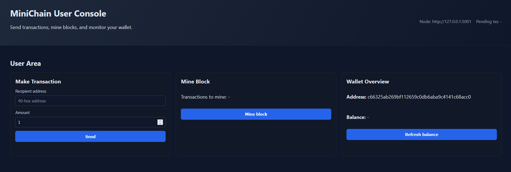

=================================================


This project implements an **educational blockchain** (toy blockchain) inspired by Ethereum, based on **ECDSA signatures (secp256k1)**. The goal is to study both the internal mechanics of a blockchain and real-world cryptographic and protocol vulnerabilities.

> **WARNING:** This repository is NOT intended for production use. All code is intentionally simple and, in some cases, deliberately insecure to demonstrate specific attacks.

---

## 1. Project Goals
The project focuses on four main objectives:

1.  **Understand basic blockchain operations**:
    * Transactions
    * Mempool
    * Blocks
    * Mining (Simplified Proof-of-Work)
    * Node synchronization
2.  **Understand ECDSA**:
    * Signing process
    * Public key handling
    * The critical role of the nonce $k$
3.  **Demonstrate real attacks**:
    * ECDSA Weak Nonce Attack (nonce reuse)
4.  **Bridge the gap** between linear algebra, cryptography, and protocol security.

### Theoretical Foundations

The project is accompanied by detailed documentation analyzing the algebraic foundations of the system. 
Key points covered in the report include:
#### Elliptic Curve Cryptography
- secp256k1 Curve: The system uses the standard elliptic curve defined by the equation $y^{2}\equiv x^{3}+7 \pmod p$.
- Public Key Transmission: The public key $Q$ is stored directly in each transaction and used to verify the signature (no public-key recovery is performed).

#### Architecture and States
- Account Model: Unlike UTXO-based systems, this project implements an Account Model where the global state $\Sigma_{t}$ maps each address to its balance and account nonce.
- Nonce Disambiguation: The system distinguishes between three fundamental types of nonces:
  1. Cryptographic Nonce ($k$): The ephemeral scalar used in the ECDSA algorithm; if reused, it leads to private key compromise.
  2. Account Nonce ($n_{acc}$): A sequential counter used to prevent duplicate transactions.
  3. Mining Nonce ($n_{pow}$): A variable field in the block header used by miners to solve the Proof-of-Work puzzle.

#### Vulnerability Analysis
- Nonce reuse analysis: The report demonstrates how reusing $k$ for two different messages allows an attacker to isolate and calculate the private key $d$.

-------------------------------------------------
## 2. Repository Structure
-------------------------------------------------
```
.
├── wallets/                 # JSON wallets with private keys (generated locally, gitignored)
├── data/                    # Persistent node state
│   └── node_<PORT>/state.json
├── minichain/               # Core blockchain logic
│   ├── crypto.py            # ECDSA, signing, verification
│   ├── chain.py             # Blockchain rules
│   ├── node.py              # HTTP node
│   └── paths.py             # Wallets management
├── scripts/                 # CLI scripts
│   ├── create_wallet.py
│   ├── create_genesis.py
│   ├── send_tx.py
│   ├── run_node_safe.py
│   ├── run_weak_nonce_webapp.py
│   └── demo_scenario.py
├── webapp/                  # Web UI (per-node user console)
│   ├── app.py
│   ├── weak_nonce_app.py
│   ├── templates/
│   └── static/
├── attacks/                 # Attack scripts
│   └── weak_nonce/
│       ├── make_weak_txs.py
│       └── recover_privkey.py
├── requirements.txt
└── README.md
```

-------------------------------------------------
## 3. Installation
-------------------------------------------------

Create a virtual environment:

```
python -m venv .venv
source .venv/bin/activate        (Linux / Mac)
.venv\Scripts\activate         (Windows)
```

Install dependencies:

```
pip install -r requirements.txt
```


-------------------------------------------------
## 4. Wallet
-------------------------------------------------

Wallets are saved in the folder: `wallets/` (not committed to git).

Each wallet contains:
- ECDSA private key
- public key
- address (20 byte hex)

Create wallets:

```
python -m scripts.create_wallet --out walletA.json
python -m scripts.create_wallet --out walletB.json
python -m scripts.create_wallet --out walletC.json
```

Files are automatically created in `wallets/`.


-------------------------------------------------
## 5. Genesis
-------------------------------------------------

`genesis.json` is generated locally (not committed to git). You can build it from wallets and allocations:

```
python -m scripts.create_genesis \
  --alloc walletA.json:100 \
  --alloc walletB.json:100 \
  --alloc walletC.json:100
```

Or use a JSON mapping (wallet filename -> amount):

```
python -m scripts.create_genesis --alloc-json alloc.json
```

Example `alloc.json`:

```json
{
  "walletA.json": 100,
  "walletB.json": 100,
  "walletC.json": 100
}
```


-------------------------------------------------
## 6. Starting nodes (SAFE)
-------------------------------------------------

Multiple nodes can be started on the same machine using different ports.

Node A (miner):

```
python -m scripts.run_node_safe --port 5001 --wallet walletA.json --genesis genesis.json --peers "http://127.0.0.1:5002,http://127.0.0.1:5003" --difficulty 2 
```

Node B:

```
python -m scripts.run_node_safe --port 5002 --wallet walletB.json --genesis genesis.json --peers "http://127.0.0.1:5001,http://127.0.0.1:5003" --difficulty 2
```

Node C:

```
python -m scripts.run_node_safe --port 5003 --wallet walletC.json --genesis genesis.json --peers "http://127.0.0.1:5001,http://127.0.0.1:5002" --difficulty 2
```

-------------------------------------------------
## 7. Normal Transactions
-------------------------------------------------

Send a transaction:
```
python -m scripts.send_tx --node http://127.0.0.1:5001 --wallet walletA.json --to <WALLET_B> --amount 5
```

Mine a block:

```
curl.exe -X POST http://127.0.0.1:5001/mine -H "Content-Type: application/json" -d "{}"
```

-------------------------------------------------
## 8. Automatic Demo Scenario
-------------------------------------------------

Simulates:
- B -> A transaction
- mining on A
- synchronization check

```
python -m scripts.demo_scenario --nodeA http://127.0.0.1:5001 --nodeB http://127.0.0.1:5002 --nodeC http://127.0.0.1:5003 --amount 5
```


# ATTACKS
-------------------------------------------------
## 9. ECDSA WEAK NONCE – Reuse
-------------------------------------------------

### Description:

If two ECDSA signatures use the same nonce $k$, the private key can be recovered.

### Generate weak transactions:

```
python -m attacks.weak_nonce.make_weak_txs --node http://127.0.0.1:5001 --wallet walletA.json --to <WALLET_B> --amount 1 --mode reuse --outdir attacks/weak_nonce/out_reuse
```

### Recover the private key:
```
python -m attacks.weak_nonce.recover_privkey --mode reuse --tx attacks/weak_nonce/out_reuse/tx1.json attacks/weak_nonce/out_reuse/tx2.json
```

-------------------------------------------------
## 10. Weak Nonce Web App (Attacker Console)
-------------------------------------------------

The weak nonce web app provides a red-themed attacker console that scans the chain for reused nonces and recovers the victim's private key.

### Quick start

1. **Create wallets**
   ```
   python -m scripts.create_wallet --out walletA.json
   python -m scripts.create_wallet --out walletB.json
   ```

2. **Create the genesis file**
   ```
   python -m scripts.create_genesis \
     --alloc walletA.json:100 \
     --alloc walletB.json:100
   ```

3. **Start node A (vulnerable signer)**
   ```
   python -m scripts.run_node_safe --port 5001 --wallet walletA.json --genesis genesis.json --difficulty 2
   ```

4. **Start node B (safe signer)**
   ```
   python -m scripts.run_node_safe --port 5002 --wallet walletB.json --genesis genesis.json --difficulty 2
   ```

5. **Run the blue user consoles**
   ```
   python -m scripts.run_webapp --port 8001 --node-url http://127.0.0.1:5001 --wallet walletA.json --weak-signer
   ```
   ```
   python -m scripts.run_webapp --port 8002 --node-url http://127.0.0.1:5002 --wallet walletB.json
   ```

6. **Run the attacker console (node C)**
   ```
   python -m scripts.run_weak_nonce_webapp --port 8010 --node-url http://127.0.0.1:5001 --wallet walletA.json
   ```

7. **Run the experiment**
   - open `http://127.0.0.1:8001`
   - send a weak transaction from A to B using the red warning button (weak nonce reuse, auto-mines once)
   - open `http://127.0.0.1:8010`
   - click “Scan & recover” to see the recovered private key and logs

-------------------------------------------------
## 11. Web App (User Console)
-------------------------------------------------



The web app provides a **per-node user console**. You run one UI per wallet/node so each operator has their own interface to send transactions, mine blocks, and monitor wallet details.

### Quick start (full tutorial)

1. **Create wallets via CLI**
   ```
   python -m scripts.create_wallet --out walletA.json
   python -m scripts.create_wallet --out walletB.json
   python -m scripts.create_wallet --out walletC.json
   ```

2. **Create the genesis file**
   ```
   python -m scripts.create_genesis \
     --alloc walletA.json:100 \
     --alloc walletB.json:100 \
     --alloc walletC.json:100
   ```

3. **Start the nodes**
   In three separate terminals:
   ```
   python -m scripts.run_node_safe --port 5001 --wallet walletA.json --genesis genesis.json --peers "http://127.0.0.1:5002,http://127.0.0.1:5003" --difficulty 2
   ```
   ```
   python -m scripts.run_node_safe --port 5002 --wallet walletB.json --genesis genesis.json --peers "http://127.0.0.1:5001,http://127.0.0.1:5003" --difficulty 2
   ```
   ```
   python -m scripts.run_node_safe --port 5003 --wallet walletC.json --genesis genesis.json --peers "http://127.0.0.1:5001,http://127.0.0.1:5002" --difficulty 2
   ```

4. **Start a user console for each node**
   Each node operator should run their own UI on a distinct port and point it to their node + wallet:
   ```
   python -m scripts.run_webapp --port 8001 --node-url http://127.0.0.1:5001 --wallet walletA.json
   ```
   ```
   python -m scripts.run_webapp --port 8002 --node-url http://127.0.0.1:5002 --wallet walletB.json
   ```
   ```
   python -m scripts.run_webapp --port 8003 --node-url http://127.0.0.1:5003 --wallet walletC.json
   ```

5. **Send a transaction**
   - enter the recipient address
   - enter the amount
   - click “Send”

6. **Mine a block**
   - check “Pending blocks”
   - click “Mine block”

7. **Check balance**
   - click “Refresh balance”
   - the wallet overview shows address + public key

-------------------------------------------------
## 12. Final Notes
-------------------------------------------------

### WARNINGS:

- Wallets contain real private keys.

- Code is intentionally insecure.

- Project for study and educational use only.

### Educational Goals:

- Understand ECDSA.

- Understand the role of the nonce.

- Observe real attacks.

- Connect algebra and security.

## Contributors

<a href="https://github.com/mich1803/ECDSA-Blockchain/graphs/contributors">
  
</a>
