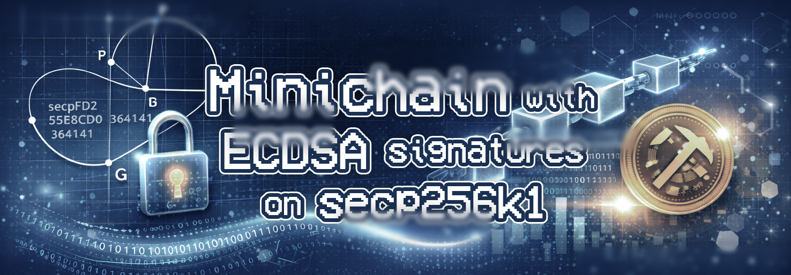

=================================================


This project implements an **educational blockchain** (toy blockchain) inspired by Ethereum, based on **ECDSA signatures (secp256k1)**. The goal is to study both the internal mechanics of a blockchain and real-world cryptographic and protocol vulnerabilities.

> **WARNING:** This repository is NOT intended for production use. All code is intentionally simple and, in some cases, deliberately insecure to demonstrate specific attacks.

---

## 1. Project Goals
The project focuses on four main objectives:

1.  **Understand basic blockchain operations**:
    * Transactions
    * Mempool
    * Blocks
    * Mining (Simplified Proof-of-Work)
    * Node synchronization
2.  **Understand ECDSA**:
    * Signing process
    * Public key recovery
    * The critical role of the nonce $k$
3.  **Demonstrate real attacks**:
    * Replay Attack
    * ECDSA Weak Nonce Attack (nonce reuse)
    * ECDSA Weak Nonce Attack (linear nonce)
4.  **Bridge the gap** between linear algebra, cryptography, and protocol security.

### Theoretical Foundations

The project is accompanied by detailed documentation analyzing the algebraic foundations of the system. 
Key points covered in the report include:
#### Elliptic Curve Cryptography
- secp256k1 Curve: The system uses the standard elliptic curve defined by the equation $y^{2}\equiv x^{3}+7 \pmod p$.
- Public Key Recovery: To optimize space, the public key $Q$ is not stored in transactions but is instead recovered from the signature $(r, s)$ using the formula $Q=r^{-1}(sR-eG)$. This operation is implemented in the `crypto.py` module.

#### Architecture and States
- Account Model: Unlike UTXO-based systems, this project implements an Account Model where the global state $\Sigma_{t}$ maps each address to its balance and account nonce.
- Nonce Disambiguation: The system distinguishes between three fundamental types of nonces:
  1. Cryptographic Nonce ($k$): The ephemeral scalar used in the ECDSA algorithm; if reused, it leads to private key compromise.
  2. Account Nonce ($n_{acc}$): A sequential counter used to prevent Replay Attacks.
  3. Mining Nonce ($n_{pow}$): A variable field in the block header used by miners to solve the Proof-of-Work puzzle.

#### Vulnerability Analysis
- Linear Cryptanalysis: The report mathematically demonstrates how reusing $k$ for two different messages allows an attacker to set up a system of linear equations in $\mathbb{Z}_n$ to isolate and calculate the private key $d$.
- Replay Attack: It analyzes how the absence of state constraints (specifically, disabling account nonce verification) allows a mathematically valid signature to be processed multiple times.

-------------------------------------------------
## 2. Repository Structure
-------------------------------------------------

.
├── README.md               (this file)
├── requirements.txt
├── .gitignore
│
├── wallets/                (JSON wallets with private keys)
│   ├── walletA.json
│   ├── walletB.json
│   └── walletC.json
│
├── data/                   (persistent node state)
│   └── node_<PORT>/state.json
│
├── minichain/              (core blockchain logic)
│   ├── crypto.py           (ECDSA, signing, recovery)
│   ├── chain.py            (blockchain rules)
│   ├── node.py             (HTTP node)
│   ├── paths.py            (wallets/ management)
│   └── ...
│
├── scripts/                (CLI scripts)
│   ├── create_wallet.py
│   ├── send_tx.py
│   ├── run_node_safe.py
│   ├── run_node_vuln.py
│   └── demo_scenario.py
│
└── attacks/                (attack scripts)
    ├── replay_attack.py
    └── weak_nonce/
        ├── make_weak_txs.py
        └── recover_privkey.py


-------------------------------------------------
## 3. Installation
-------------------------------------------------

Create a virtual environment:

```
python -m venv .venv
source .venv/bin/activate        (Linux / Mac)
.venv\Scripts\activate         (Windows)
```

Install dependencies:

```
pip install -r requirements.txt
```


-------------------------------------------------
## 4. Wallet
-------------------------------------------------

Wallets are saved in the folder: `wallets/`

Each wallet contains:
- ECDSA private key
- public key
- address (20 byte hex)

Create wallets:

```
python -m scripts.create_wallet --out walletA.json
python -m scripts.create_wallet --out walletB.json
python -m scripts.create_wallet --out walletC.json
```

Files are automatically created in `wallets/`.


-------------------------------------------------
## 5. Starting nodes (SAFE)
-------------------------------------------------

È possibile avviare più nodi sullo stesso PC usando porte diverse.

Node A (miner):

```
python -m scripts.run_node_safe --port 5001 --wallet walletA.json --genesis genesis.json --peers "http://127.0.0.1:5002,http://127.0.0.1:5003" --difficulty 2 
```

Node B:

```
python -m scripts.run_node_safe --port 5002 --wallet walletB.json --genesis genesis.json --peers "http://127.0.0.1:5001,http://127.0.0.1:5003" --difficulty 2
```

Node C:

```
python -m scripts.run_node_safe --port 5003 --wallet walletC.json --genesis genesis.json --peers "http://127.0.0.1:5001,http://127.0.0.1:5002" --difficulty 2
```

-------------------------------------------------
## 6. Normal Transactions
-------------------------------------------------

Send a transaction:
```
python -m scripts.send_tx --node http://127.0.0.1:5001 --wallet walletA.json --to <WALLET_B> --amount 5
```

Mine a block:

```
curl.exe -X POST http://127.0.0.1:5001/mine -H "Content-Type: application/json" -d "{}"
```

-------------------------------------------------
## 7. Automatic Demo Scenario
-------------------------------------------------

Simulates:
- B -> A transaction
- mining on A
- synchronization check

```
python -m scripts.demo_scenario --nodeA http://127.0.0.1:5001 --nodeB http://127.0.0.1:5002 --nodeC http://127.0.0.1:5003 --amount 5
```


# ATTACKS
-------------------------------------------------
## 8. Replay Attack
-------------------------------------------------

### Description:
A replay attack consists of re-sending an IDENTICAL signed transaction. If the protocol does not protect nonces and duplicates, the same transaction can be accepted multiple times.

In this project, the vulnerable node:

- Does not verify the nonce
  
- Does not increment the nonce
  
- Accepts duplicates

### Nodo A (vulnerable):

```
python -m scripts.run_node_vuln --port 5001 --wallet walletA.json --genesis genesis.json --peers "http://127.0.0.1:5002,http://127.0.0.1:5003" --difficulty 2 --no-dedup
```

### Nodo B (attaccante):

```
python -m scripts.run_node_safe --port 5002 --wallet walletB.json --genesis genesis.json --peers "http://127.0.0.1:5001,http://127.0.0.1:5003" --difficulty 2
```

### Attack execution:

```
python -m attacks.replay_attack --nodeA http://127.0.0.1:5001 --nodeB http://127.0.0.1:5002 --amount 5 --replays 5
```

### Result:
The same transaction is applied multiple times, causing unauthorized repeated transfers.


-------------------------------------------------
## 9. ECDSA WEAK NONCE – Reuse
-------------------------------------------------

### Description:

If two ECDSA signatures use the same nonce $k$, the private key can be recovered.

### Generate weak transactions:

```
python -m attacks.weak_nonce.make_weak_txs --node http://127.0.0.1:5001 --wallet walletA.json --to <WALLET_B> --amount 1 --mode reuse --outdir attacks/weak_nonce/out_reuse
```

### Recover the private key:
```
python -m attacks.weak_nonce.recover_privkey --mode reuse --tx attacks/weak_nonce/out_reuse/tx1.json attacks/weak_nonce/out_reuse/tx2.json
```

-------------------------------------------------
## 10. ECDSA WEAK NONCE – Linear
-------------------------------------------------

### Description:
Nonce generated as: $k = a \cdot z + b \pmod{n}$
With 3 signatures it is possible to solve the system and recover the private key.

### Generation:
```
python -m attacks.weak_nonce.make_weak_txs --node http://127.0.0.1:5001 --wallet walletA.json --to <WALLET_B> --amount 1 --mode linear --outdir attacks/weak_nonce/out_linear
```
### Key Recovery:
```
python -m attacks.weak_nonce.recover_privkey --mode linear --tx attacks/weak_nonce/out_linear/tx1.json attacks/weak_nonce/out_linear/tx2.json attacks/weak_nonce/out_linear/tx3.json
```

-------------------------------------------------
## 11. Final Notes
-------------------------------------------------

### WARNINGS:
- Wallets contain real private keys.

- Code is intentionally insecure.

- Project for study and educational use only.

### Obiettivi didattici:
- Understand ECDSA.

- Understand the role of the nonce.

- Observe real attacks.

- Connect algebra and security.
